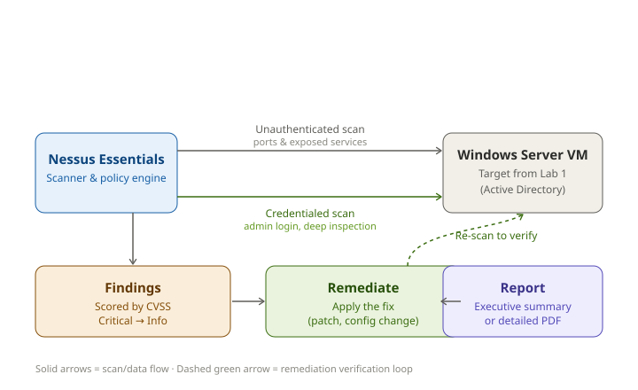

# Lab 5 — Vulnerability Scanning with Nessus Essentials

Standing up Tenable Nessus, scanning a lab server from both an outsider's and an insider's perspective, scoring what gets found, fixing one issue, and proving the fix actually stuck.


## 🎥 Demo Video
[Watch me run this lab end-to-end →](PASTE_YOUR_LINK_HERE)

## Overview

| Field | Value |
|---|---|
| Certification alignment | Security+ · CySA+ · PenTest+ |
| Tools used | Tenable Nessus Essentials (free, up to 5 IPs) |
| Time invested | 3–4 hours |
| Cost | $0 |
| Career relevance | Vulnerability Analyst, Security Engineer, SOC Analyst, Cloud Security Engineer |

## Why This Matters

No network is fully secure — the real differentiator is whether an organization finds its own weak points before someone outside does. That's the entire discipline of vulnerability management: continuously identifying, scoring, and closing gaps before they turn into incidents.

Nessus is the tool most security teams reach for to do exactly that. It's one of the most recognized names in the industry, yet a surprising number of people entering the field have only heard about it in passing rather than actually run a scan themselves. This lab closes that gap — going through the full lifecycle of finding a weakness, understanding how serious it actually is, fixing it, and confirming the fix worked.

**How this connects to real roles:**
- A **Vulnerability Analyst** spends their entire day scanning, triaging results, and tracking fixes — this lab is that job in miniature
- A **Security Engineer** uses CVSS scoring to decide what gets patched first and what can wait
- A **SOC Analyst** treats a host with known unpatched vulnerabilities as a higher-priority alert the moment it shows up in a case
- A **Cloud Security Engineer** applies this same logic inside tools like Microsoft Defender for Cloud or AWS Inspector — Nessus just teaches the underlying concept without the cloud abstraction layer in the way

## How This Lab Works



## The Bigger Picture

Vulnerability management isn't a single scan — it's a loop that never really stops:

```
Scan the environment → Surface findings → Score by severity →
Decide what matters most → Fix it → Re-scan to confirm → repeat
```

This lab runs that loop once, start to finish, on a single lab machine — but it's the same cycle a security team runs continuously across an entire company.

---

## Step-by-Step Setup

### Getting Nessus running

1. Head to `tenable.com/products/nessus/nessus-essentials` and click **Get Started for Free**
2. Enter a name and email — no payment information required at any point
3. An activation code lands in your inbox — hang onto it, you'll need it during setup
4. Grab the installer that matches your OS:

| Platform | How to install |
|---|---|
| Windows | Run the `.exe` — it installs and runs as a background service |
| Ubuntu/Debian | `sudo dpkg -i Nessus-10.x.x-ubuntu1404_amd64.deb && sudo systemctl start nessusd` |
| RHEL/CentOS | `sudo rpm -ivh Nessus-10.x.x-el9.x86_64.rpm && sudo systemctl start nessusd` |
| macOS | Open the `.dmg`, drag Nessus into Applications, launch it from System Preferences |

5. Browse to `https://localhost:8834` — Nessus runs locally over this port
6. Pick **Nessus Essentials**, drop in the activation code from your email
7. Set an admin username and password
8. Sit tight for 10–20 minutes while the plugin library downloads on first launch

> The free tier covers 5 IP addresses, which comfortably covers a small home lab. Students can get a year of Nessus Essentials Plus (20 IPs) at no cost through `academic.tenable.com`.

### Scanning without credentials — the outsider's view

This first scan shows exactly what someone with zero access could see just by probing the network — open ports, exposed services, nothing more.

9. **New Scan → Basic Network Scan**
10. Call it something like `Lab Network Discovery`, point it at the Windows Server VM's IP from Lab 1 (something like `10.0.1.4`)
11. Hit **Save**, then press play to kick it off
12. Give it 5–10 minutes to finish
13. Open the scan to watch results come in live

> ⚠️ Only ever point Nessus at systems you own or have written permission to test. To a network monitoring tool, a Nessus scan is indistinguishable from an actual attack in progress.

### Scanning with credentials — the insider's view

This is where the real value shows up. Logging in during the scan lets Nessus inspect the system from within — patch levels, installed software, registry misconfigurations — and it typically surfaces 5 to 10 times more findings than the outside-only scan.

14. **New Scan → Basic Network Scan** again, this time named something like `Lab Windows Server — Credentialed`
15. Target the same Windows Server VM IP
16. Go to the **Credentials** tab → **Add → Windows → Password**, and supply the admin username, password, and the `LAB` domain name
17. Before launching, flip on Remote Registry on the target machine:

```powershell
# Run this in PowerShell on the Windows Server
Set-Service -Name RemoteRegistry -StartupType Automatic
Start-Service RemoteRegistry

# If Nessus lives on a different machine, open the firewall for it too:
netsh advfirewall firewall add rule name='Nessus' dir=in action=allow protocol=tcp localport=445
```

18. Kick off the scan — this one takes longer, plan for 15–20 minutes

### Making sense of the results

Every finding Nessus surfaces comes with a **Synopsis**, a fuller **Description**, a **Solution**, a **CVE identifier**, a **CVSS score**, a **Risk Factor**, and raw **Plugin Output** as evidence.

**What the severity scale actually means:**

| Severity | CVSS Score | Translation | Real example |
|---|---|---|---|
| Critical | 9.0–10.0 | Exploitable remotely with barely any effort — drop everything | EternalBlue (MS17-010) |
| High | 7.0–8.9 | Serious if exploited — fix within one to two weeks | Unpatched RDP flaw |
| Medium | 4.0–6.9 | Needs specific conditions to be exploitable — fix within a month | Expired SSL cert, weak cipher suite |
| Low | 0.1–3.9 | Minor exposure — bundle into normal patch cycles | Missing security headers |
| Info | 0 | Not actually a vulnerability, just system detail | Detected open port, OS fingerprint |

### Closing the loop — fixing something and proving it

19. Choose one Medium or High finding to actually resolve
20. Apply exactly what the **Solution** field recommends

**A few fixes that come up constantly on a Windows target:**

```powershell
# Apply pending Windows updates
Install-Module PSWindowsUpdate -Force
Get-WindowsUpdate -Install -AcceptAll

# Turn off TLS 1.0 — one of the most common findings
New-Item 'HKLM:\SYSTEM\CurrentControlSet\Control\SecurityProviders\SCHANNEL\Protocols\TLS 1.0\Server' -Force
New-ItemProperty -Path 'HKLM:\SYSTEM\CurrentControlSet\Control\SecurityProviders\SCHANNEL\Protocols\TLS 1.0\Server' -Name 'Enabled' -Value 0 -PropertyType DWORD -Force

# Turn off SMBv1 — also flagged constantly
Set-SmbServerConfiguration -EnableSMB1Protocol $false -Force
```

21. Re-run the credentialed scan
22. Confirm the finding you fixed is actually gone from the results

Skipping this last step is the most common shortcut people take — and it's the one that matters most. A fix nobody verified is just a guess.

### Getting a report out of it

23. Open the finished scan → **Report → PDF**
24. Pick **Executive Summary** for a leadership-friendly overview, or **Detailed Vulnerabilities** if the goal is remediation tracking
25. **Generate Report**

---

## What I Actually Did in This Lab

- Registered for Nessus Essentials and got it running against a lab environment
- Ran an unauthenticated scan against the Lab 1 Windows Server to see what's visible from outside
- Ran a credentialed scan with local admin access, after first enabling Remote Registry and the matching firewall rule
- Compared the two result sets directly — the difference between outsider and insider visibility was immediately obvious
- Picked a finding worth fixing based on its CVSS score, applied the recommended fix, and re-scanned to confirm it cleared
- Pulled both an executive summary and a detailed technical report out of the finished scan

## Skills This Demonstrates

| Skill | Why it's relevant on the job |
|---|---|
| Standing up and configuring a scanner | Every enterprise vulnerability program is built on this same scanner/policy/target architecture |
| Running unauthenticated scans | Shows the outside-in perspective an attacker actually has |
| Running credentialed scans | The real standard for meaningful internal vulnerability coverage |
| Reading and applying CVSS scores | The common language every security conversation uses to talk about severity |
| Prioritizing findings | A high score on an isolated test box matters less than a lower score on something internet-facing |
| Running the fix-then-verify loop | The actual discipline behind vulnerability management, not just the scanning part |
| Producing audience-appropriate reports | Leadership wants risk in plain terms; engineers want the CVE and the fix |

## How I Verified It Worked

| Check | Result |
|---|---|
| Discovery scan completed | Returned results (even a well-patched box shows Info-level findings) |
| Credentialed scan completed | Finding count was substantially higher than the unauthenticated pass |
| Remote Registry + firewall prerequisites | Confirmed active before launching the credentialed scan |
| Remediation | At least one finding disappeared after the fix and re-scan |
| Reporting | PDF generated and reviewed for accuracy |

## Takeaways

- **The credentialed scan is where the real work happens.** An unauthenticated scan alone tells you almost nothing — it's reconnaissance, not vulnerability management.
- **Remote Registry has to be running before you scan**, not something you troubleshoot after a suspiciously thin result set.
- **A fix you don't re-verify isn't actually a fix** — it's an assumption. The re-scan is what turns "I think I patched it" into "I confirmed it's patched."
- **Severity and urgency aren't the same thing.** A Critical on an isolated test box can wait longer than a High on something exposed to the internet — CVSS gives you the starting point, context does the rest.

## Related Labs

- **Lab 1** — Active Directory deployment (the source of the Windows Server VM used in this lab)
- **Lab 3** — Splunk SIEM & Log Analysis
